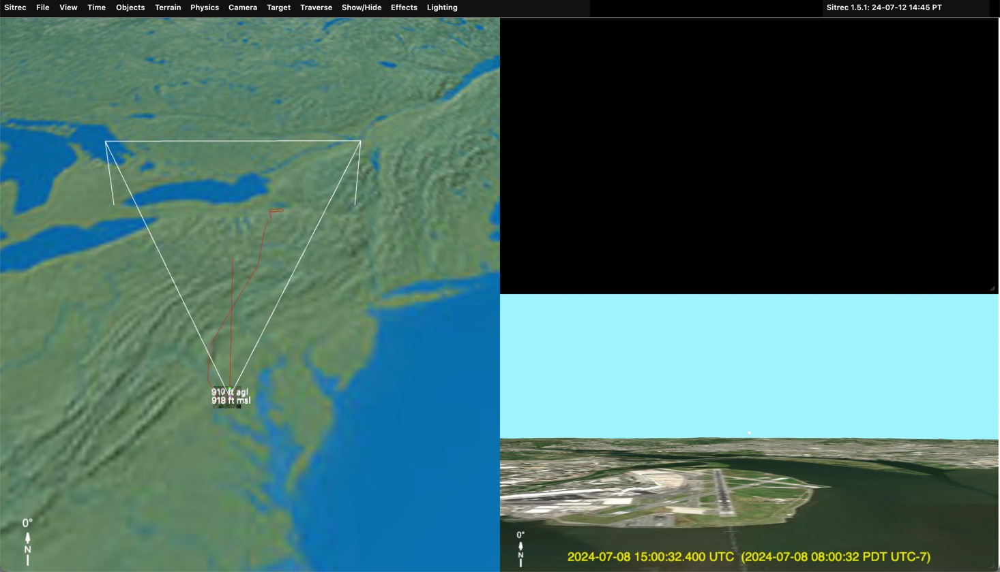

# The Sitrec Custom Sitch Tool

Sitrec is a powerful tool that allows you to set up sitchs (situations) by either coding them directly, or by setting up a custon JSON file. 

Both those methods are powerful, but cumbersom. A sompler way that will work for many sitches is to use the _Custom Sitch Tool_.

The custom sitch tool is designed so you can simply import data (either via the "import" option on the file menu, or by dragging and dropping it directly into the browser window)

Before reading this, it's a good idea to familiarize yourself with the [User Interface](UserInterface.md) documentation. 

## Custom Sitch Basics

A Sitch is generally a recreation of a video involving a UAP (an unidentified object). As such there are some fundamental components

- The Camera Position
- The Camera Heading
- The Camera's field of view
- Other known object in the scene
- A potential UAP

The position of the camera, and the other known objects, is defined by a track. A track is just a list of positions at known times, sometimes with other data embedded in the same track, like where the camera is heading. 

To get a track into Sitrec, just import it (again, either via the "import" option on the file menu, or by dragging and dropping it directly into the browser window). The currently supported track formats are:

- KML or KMZ formatted ADS-B tracks. These are typically files exported from a flight tracking service such as FlightRadar24, Planefinder.net, FLightAware.com, or ADSB Exchange. 
- DJI drone data in CSV format. This has to be extracted from the encrypted data file using an online service. 
- CSV files. These currently need the relevent columns with headers matching the default MISB field names
- MISB KLV files. This is MISB data, typically embedded in a .TS video file. To import this into Sitrec, you need to convert it to KLV format, for example with ffmpeg (e.g. ffmpeg -i truck.ts  -map 0:1 -c copy -f data output.klv ). These files can vary in format. 

There are other ways a track can be created, for example from a file listing speed and bank angles of a plane over time. These are not currently supported in the Custom Sitch Tool as thye generally require custom code. 

(Sitrec is a work in progress, and I code largely around the data I have available. If there is a data format that is not supported that you have data available for, then I'd be happy to support it if you can give me the data. If you want it supported, but _can't_ give me the data, then that ,_might_ also be possible. Drop me a line: mick@mickwest.com )

# Working with ADS-B Tracks

So, you've got a track of a camera, just drag it in. You'll see something like this 

Sitrec will center the main view over the track you just loaded. The Look View will initialy be pointing in a random direction, but the the camera will be locked to the start of the track you just loaded. The terrain around the start point will also be loaded (that's the small patch visible)
